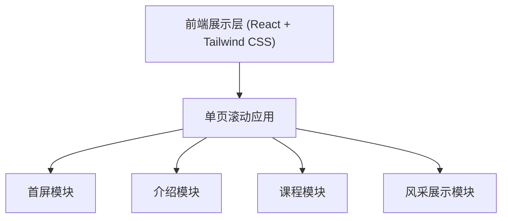

## 1. 架构设计

## 2. 技术说明
- **前端框架**: React@18 + tailwindcss@3 + vite
- **动画库**: Framer Motion (用于实现板块之间的连续性滚动动画和彩虹渐变效果)
- **图标库**: Lucide React
- **初始化工具**: Vite

## 3. 路由定义
| 路由 | 目的 |
|-------|---------|
| / | 唯一的首页，包含所有宣传与介绍内容 |

## 4. 数据模型
无后端，所有数据为静态配置的展示数据。