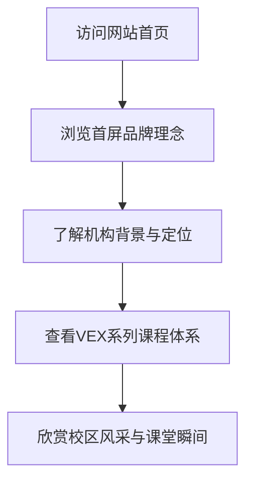

## 1. 产品概述
本项目为卓越科技BricksWorkshop开发的官方宣传与介绍网站。
- 作为中国西北首家VEX学苑（位于陕西汉中），网站旨在通过极简、阳光且具有科技感的设计，向公众展示机构的专业形象和教育理念。
- 网站为纯展示性质，不包含报课或在线咨询功能。

## 2. 核心功能

### 2.1 页面模块
1. **首页**: 包含首屏展示、机构介绍、课程体系展示、校区风采。

### 2.2 页面详细信息
| 页面名称 | 模块名称 | 功能描述 |
|-----------|-------------|---------------------|
| 首页 | 首屏展示 (Hero) | 全白背景下的极简标题与口号，彩虹色调点缀，传达阳光积极的科技感。 |
| 首页 | 机构介绍 (About) | 介绍西北首家VEX学苑的定位与汉中滨江路校区背景。 |
| 首页 | 课程体系 (Curriculum) | 展示VEX 123/GO/IQ等教育体系，强调建模与专注力培养。 |
| 首页 | 校区风采 (Gallery) | 沉浸式的图文排版，展示学生在课堂上的实践场景。 |

## 3. 核心流程
用户进入网站后，通过垂直滚动依次浏览机构的核心价值。

## 4. 用户界面设计
### 4.1 设计风格
- **主色调**: 全白背景 (#FFFFFF)。
- **点缀色**: 彩虹色系（红、橙、黄、绿、蓝、紫的渐变或鲜艳的高饱和度色彩），用于文字高亮、图标、边框或微妙的背景光晕，体现“积极向上阳光”的氛围。
- **按钮/卡片风格**: 极简的无边框设计，大面积留白，轻微的阴影或彩虹渐变描边。
- **字体**: 现代化、极简的无衬线字体（如 Inter, Roboto 或系统默认现代字体），标题大而醒目。
- **布局风格**: 强连续性的单页滚动布局（One-page scrolling），板块之间通过微妙的色彩过渡或滚动动画连接。

### 4.2 页面设计概览
| 页面名称 | 模块名称 | UI 元素 |
|-----------|-------------|-------------|
| 首页 | 首屏展示 | 巨大加粗的标题，彩虹渐变文字，极简的线条动画。 |
| 首页 | 机构介绍 | 大段落排版，搭配留白，使用科技感Icon。 |
| 首页 | 课程体系 | 错落有致的卡片展示VEX 123/GO/IQ，悬浮时有彩虹光晕效果。 |
| 首页 | 校区风采 | 瀑布流或横向滚动的极简图片展示区域。 |

### 4.3 响应式设计
采用桌面端优先（Desktop-first）策略，同时完美适配移动端浏览，确保移动设备上的滚动体验同样流畅且连续。